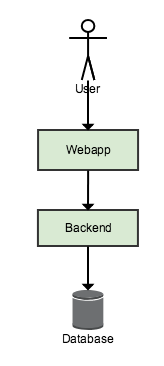

# Studentkurs 2019

I dette kurset skal vi sette opp en web-applikasjon med lagring til database med Amazon Web Services. Web-applikasjonen er en enkel sak for å opprette, endre, slette og se på arrangementer. Den er skrevet i TypeScript med React.

<br/>

## Oppsett av utviklingsmiljø lokalt

Sørg for at du har gjort det som trengs på forhånd. Se PDF som ble sendt ut før kurset. Hvis du ikke har fått den, ligger den [her]()

Presentasjonen som Capra holdt kan du finne [her]().

Når du er klar kan du fortsette med følgende:

1. Klon dette repoet med koden for Lambda funksjoner

```
$ git clone https://github.com/capraconsulting/studentkurs-2019
```

2. Klone [webapp](https://github.com/capraconsulting/studentkurs-2019-webapp) og følg instruksjonene fra README-filen der for å komme i gang

```
$ git clone https://github.com/capraconsulting/sutdentkurs-2019-webapp
```

Da er du klar til å sette i gang!

<br/>

## Amazon Web Services (AWS)

Amazon Web Services tilbyr en rekke tjenester. De har tjenester for å kjøre enkle virtuelle servere, for å sende e-post, prosessere enorme datamengder, lagring i ulike formater, lagring av filer og hosting av statisk innhold til nettsider, for å nevne noe.

For å kunne bruke AWS trenger man en konto. Man får mye selv med gratis-nivået, slik at man kan komme i gang uten å bekymre seg for at det blir dyrt.

Det finnes flere måter å jobbe med AWS på. Man kan bruke nettleseren, kommandolinjen eller lage egne maler. Sistnevnte gjør at man kan lage infrastruktur med kode. AWS sin tjeneste for dette heter CloudFormation. Akkurat CloudFormation er ikke noe vi skal benytte i dette kurset, men det kan være fint å vite om.

I dette kurset skal vi først sette opp tjenester med nettleseren, i den såkalte konsollen. Videre kan vi velge å oppdatere tjenester med nettleseren, eller Command-Line Interface (CLI) som AWS tilbyr. Dette er ikke nødvendig, men kan være nyttig.

<br/>

## Vi setter opp AWS-tjenester for applikasjonen vår

En vanlig web-applikasjon har tre lag: frontend, backend og en database. Frontenden er det vi ser, brukegrensesnittet. Backend har logikk og håndterer henvendelser fra frontend. Databasen lagrer data. Denne enkle figuren viser hvordan det kan se ut:



Når vi kjører dette, enten lokalt eller på en server, kjører vi ofte tre ting: En web-applikasjon (frontend), en backend-applikasjon (for eksempel skrevet i Java) og en database (som Postgres eller MySQL). Da må man passe på at serveren, eller egen maskin, er oppdatert og tettet for alle sikkerhetshull.

Når vi jobber med AWS, kan vi i stedet bruke tjenester som er spesielt designet for det vi ønsker å gjøre, være seg å kjøre backend-kode eller vise en web-applikasjon. Man kan kombinere tjenester slik at man oppnår de egenskapene til systemet som man ønsker. I dette kurset vil vi ha en arkitektur som ser slik ut:


| Tjeneste                    | Fortkortelse | Hva bruker vi den til?                                                                                                                                                                                                                                                                                                                    |
| :-------------------------- | :----------- | :---------------------------------------------------------------------------------------------------------------------------------------------------------------------------------------------------------------------------------------------------------------------------------------------------------------------------------------- |
| Simple Storage Service      | S3           | S3 brukes til lagring av data som skal aksesseres rimelig ofte. Det betyr gjerne at nettsider og bilder lagres her. For eksemepl bruker Imgur S3 til å lagre nettsider. S3 brukes også i stor grad til å lagre og vise statiske nettsider og web-applikasjoner.                                                                           |
| API Gateway                 | -            | API Gateway lar deg definere endepunkt, og la disse peke på andre tjenester i AWS. Det betyr at du for eksempel kan lage et endepunkt for å lagre bilder i API Gateway, og peke det rett til S3. Da trenger du ikke programmere noe for å oppnå lagring via et API.                                                                       |
| Relational Database Serivce | RDS          | RDS er en tjeneste for relasjonsdatabase. Her kan du lage databaseinstanser av typer som MySQL og Postgres. Med tradisjonelle servere må man selv passe på databaseinstansen med hensyn til oppetid og sikkerhetshull, fordi de kjører på en server. Med RDS forholder du deg kun til databaseinstansen, ikke til serveren den kjører på. |
| Lambda Functions            | -            | Lambda Functions lar deg kjøre koden din, helt uten en tradisjonell server. ...                                                                                                                                                                                                                                                           |

Videre vil vi sette opp hver av disse tjenestene etter tur.

<br/>

### Steg 1: Sette opp Simple Storage Service (S3)

I første steg skal vi, så enkelt og raskt som mulig, legge web-applikasjonen vår på det åpne nettet. Det vil si: Vi skal kunne nå web-applikasjonen fra en nettadresse. For å gjøre det må vi gjøre tre ting:

1. Opprette en _bucket_ i S3
2. Gjøre innholdet åpent tilgjengelig
3. Laste opp web-applikasjonen til bucketen

Vi kjører i gang!

<br/>

#### Opprette en bucket i S3

1. Logg inn i [AWS Management Console](https://eu-north-1.console.aws.amazon.com/console)
2. Naviger til S3. Det enkleste er å søke i feltet under «Find services».
3. Du har nå kommet til S3, som viser deg en liste over de _buckets_ du har. Den er foreløpig tom. En bucket er som en slags mappe du kan konfigurere. For å opprette en slik, trykk «Create bucket»
4. Gi den et navn som er DNS-compliant, det vil si at det må kunne være et gyldig domene. Navn på _buckets_ må være unikt globalt. Det betyr at ikke alle på kurset kan ha samme navn på sin bucket. Vi foreslår at du gir denne bucketen `<hva du vil kalle din Event-tjeneste>.no`, for eksempel `123events.no`. Trykk «Next».
5. I neste steg kan du gjøre flere valg for bøtta, som å tagge den (nyttig hvis man har mye forskjellig på en og samme AWS-konto), eller skru på versjonering av objektene. Vi trenger ikke noe av dette når vi bare skal lagre en nettside, så vi trykker «Next».
6. Dette steget kontrollerer hvilke kontoer som kan sette tilganger for denne bucketen. For at vi skal kunne laste opp objekter og sette disse helt public (det skal jo være en nettside), må vi fjerne markeringen ved «Block new public ACLs and uploading public objects (Recommended)» og «Remove public access granted through public ACLs (Recommended)». Gjør dette, og trykk «Next».
7. Da kommer vi til siste steg. Trykk «Create bucket».

<br/>

#### Gjør innholdet åpent tilgjengelig

Når bucketen er opprettet må vi gjøre den public. Det gjør vi ved å trykke på navnet på bucketen, slik at vi går inn på den. Deretter gjør vi følgende:

1. Velg «Properties» øverst
2. Trykk på «Static web hosting»
3. Kopier URL som står etter «Endpoint». Dette blir URL til webappen, så den må du lagre til senere.
4. Velg «Use this bucket to host a website»
5. Under «Index document» skriver du `index.html`, altså standard verdi man bruker for indeksdokument til en nettside.
6. Trykk «Save»

Nå er selve bucketen åpnet for å kunne nås utenfra. Nå må vi laste opp innhold, og sørge for at det også kan nås utenfra.

<br/>

#### Publiser applikasjonen

Nå som du har en bucket med de ønskelige egenskaper og rettigheter, er vi _nesten_ klar for å laste opp web-applikasjonen. Først, verifiser at du har bygget den. Det gjør du ved å se at du har en `dist` mappe i mappen til web-appen. Hvis du ikke har det, gå til web-appen sin README og se hvordan du bygger applikasjonen.

Når du har et bygg er alt klart: Vi kan publisere appen! Det gjør vi enten ved å dra filene vi vil publisere over i bucketen ved hjelp av nettleseren, eller vi kan gjøre det ved hjelp av kommandolinjen.

**Med nettleseren:**

1. Logg inn i/åpne AWS Management Console, gå til S3 og åpne bucketen du ønsker å legge innholdet i.
2. Trykk «Upload», åpne en filutforsker, marker innholdet i `dist`-mappen i web-approsjektet og dra innholdet over til AWS-vinduet
3. Trykk «Next»
4. Under «Manage public permissions» velger du `Grant public read access to this object(s)`.
5. Trykk «Next»
6. Og «Next» nok en gang. Til slutt «Upload»

**Med kommandolinje:**

1. Åpne en ny terminal og gå til mappen du har klonet web-applikasjonen i
2. Åpne et shell og logg inn med din AWS-konto. For å verifisere at du er logget inn kan du kjøre følgende kommando. Den lister alle S3-buckets du har på din konto.

```
$ aws s3 ls
```

3. Publiser innholdet i din bucket med tilgang slik at alle kan lese filene:

```
$ aws s3 cp dist/ s3://<navn på bucket> --acl public-read --recursive
```

Når opplasting er ferdig bør du kunne nå applikasjonen på URLen vi lagret i stad.

<br/>

### Steg 2: Relational Database Serivce (RDS)

Vi oppretter en database i RDS, slik at vi har et sted å lagre data. Vi skal kunne nå denne fra Lambda funksjonene. Det er da to steg:

1. Opprette databaseinstansen
2. Hente ut de instillingene vi trenger å gi til Lambda-funksjonene, slik at de kan koble til.
3. Konfigurere sikkerhetsinstillinger for at ikke hvem som helst skal kunne koble seg på databasen vår
4. Koble oss på databaseinstansen og opprette tabell for data, slik at applikasjonen har noe å lese og skrive fra/til der

<br/>

#### Opprett databaseinstans i AWS

1. Gå til RDS og velg «Create database»
2. I første steg velger vi type database. I dette kurset velger vi Postgres, så velg dette og trykk «Next»
3. Under _Use case_ velger du «Dev/Test» og trykker «Next»
4. I dette steget velger vi en rekke detaljer om databasen vi skal sette opp. Det viktigste her er «DB instance class» sier noe om hvor stor last instansen vil kunne håndtere, og dermed også kostnandsnivået. Vi trenger ikke mer enn `db.t3.micro`
5. Under «Settings» setter vi navn på instansen, og brukernavn og passord for den. Instansnavnet kan for eksempel være `eventsapp`. Brukernavnet kan godt være det samme. Passordet bør være noe du finner på selv. Husk å notere deg navn, brukernavn og passord slik at du har det til senere. Trykk «Next»
6. I dette steget får vi en rekke valg for databasen. Vi lar det meste stå som standard. Vi skal først og fremst sette et navn på databasen som skal kjøre på databaseinstansen. Dette gjøres under feltet «Database name». Navnet kan godt være det samme om instansen, `eventsapp`. Trykk «Create database»

<br/>

#### Hent ut instillinger

Nå skal vi hente ut URL til databasen, slik ta vi kan la koden vår koble seg på den senere:

1. Trykk «Databases» til venstre
2. Finn databasen du nettopp lagde, og vent til status er blitt «Available». Dette kan ta noen minutter. Når den er det, trykker du på den.
3. Lagre verdien som står under «Endpoint», slik at vi har den til senere.. Den vil være noe sånt som: `<ditt-database-navn>.cwkzdvvfjrvm.eu-north-1.rds.amazonaws.com`.

<br/>

#### Opprett regler for tilgang til database

Vi ønsker at å begrense hvem som har tilgang til å koble seg på databasen.

1. Velg "Services" helt øverst og deretter "EC2" under "Compute"-kategorien.
2. Under "Network & Security" i fanen til venstre trykker du på "Security Groups"
3. Trykk på Security Group-en som har `rds-launch-wizard` som "Group Name"
4. Velg fanen "Inbound". Du ser nå en oversikt over regler for innkommende trafikk til denne sikkerhetsgruppen. Trykk "Edit".
5. Legg til en ny regel ("Add Rule") og fyll den ut med `Type: PostgreSQL` og `Source: Custom`. I input-feltet kan du begynne å skrive "sg" og du vil da få opp en liste med sikkerhetsgrupper. Velg ID-en til `rds-launch-wizard`. Dette står som "Group ID" i listen over Security Groups.
6. Det skal da se ca slik ut:


<br/>
#### Sett opp databasemodell

En relasjonsdatabase trenger en tabell å lagre data. Vi må gi dette til databasen vår. For å gjøre det skal vi kjøre en SQL-statement som oppretter denne. For å gjøre det må vi skrive en SQL-statmenet, koble oss på databasen og kjøre dette.

SQL har vi alt skrevet, du finner det i `db`-mappa. Det heter `setup.sql`. Sjekk at brukernavnet som står der, `eventsapp`, er det samme som oppga som brukernavn da du opprettet databasen. Deretter gjør du følgende:

1. Åpne Pgadmin (hvis du ikke installerte det på forhånd finner du det [her](https://www.pgadmin.org/))
2. Trykk på «Add connection to a server» øverst til venstre. Du oppgir tilkoblingsdetaljer som du fant i tidligere steg, altså URL til database, samt brukernavn og passord som du satte for databasen din.
3. Når du har koblet til, dobbeltklikk på «Databases» slik at du får opp databasene. Velg den du opprettet da du lagde instansen, og trykk på SQL-knappen på oppgavelinja (til høyre for søppelbøtta)
4. Kopier inn SQL fra `db/setup.sql` og lim inn i SQL-vinudet før du trykker på «Play»-knappen øverst. Hvis alt går etter planen vil det gi beskjeden `Query returned successfully with no result in 73 msec.`

Dette kan vi også gjort via terminalen, med verktøyet `psql` (mer informasjon [her](https://www.postgresql.org/docs/9.2/app-psql.html)). Da kjører man kommandoen:

```
$ psql -U <brukernavn>  --password -h <url til database> -d <databasenavn> -a -f db/setup.sql
```

Her er URL til databasen altså den vi hentet ut tidligere, altså `<databaseinstansnavn>.cwkzdvvfjrvm.eu-west-1.rds.amazonaws.com` for eksempel `eventsappinstance.cwkzdvvfjrvm.eu-west-1.rds.amazonaws.com`

For eksemepel:

```
$ psql -U eventsappuser  --password -h eventsappinstance.cwkzdvvfjrvm.eu-west-1.rds.amazonaws.com -d eventsapp -a -f db/setup.sql
```

### Steg 3: Lambda Functions

Lambda er en tjeneste i AWS for å kjøre kode på forespørsel uten tradisjonelle servere. Med andre ord kjøres koden kun ved behov, for eksempel ved kall fra API Gateway. Det betyr at vi kan ha en backend, eller en funksjon, for hvert eneste endepunkt. Det gjør videre at vi får en applikasjon hvor de ulike endepunktene har veldig liten kobling mellom hverandre, og kan oppdateres uavhengig av hverandre.

I dette steget skal vi opprette Lambda-funksjoner, ett for hvert endepunkt. Deretter skal vi laste koden vår opp, enten ved hjelp av CLI eller nettleseren.

<br/>

#### Opprett Lambda-function

1. Åpne eller logg inn i [AWS Management Console](https://eu-north-1.console.aws.amazon.com/console)
2. Sjekk at du er i AWS-region Stockholm, også kjent som `eu-north-1`. Dette ser du øverst i venstre hjørnet. Hvis du ikke er det allerede, bytter du til `eu-north-1` Stockholm.
3. Gå til Lambda
4. Trykk «Create function»
5. Du sjekker at «Author from scratch» er valgt øverst. Du gir funksjonen et navn under «Name». Dette bør være noe unikt, som gjør at du kjenner igjen funksjonen. For eksemepl `myeventsapp-GET-events`. Under Runtime velger du Java 8. Under «Role» velger du «Create a custom role», noe som åpner et nytt vindu. Der kan du bare trykke «Allow» nederst til høyre.
6. Trykk «Create function»

<br/>

#### Bygg Lambda-funksjonene

Lambda-funksjonene ligger i `lambda`-mappen i dette repositoriet, og er skrevet i Java. Lambda trenger at dette er en ferdigbygget `JAR`-fil, eller en `ZIP` av Java-filer. Du bygger alle ved å gå til mappen og skrive `mvn clean install`i terminalen.

<br/>

#### Last opp koden til Lambda-function

Når vi har bygd en JAR-fil for hvert endepunkt, kan vi hver og en opp til en Lambda ved hjelp av konsoll eller kommandolinjen. Gjør det for hvert av endepunktene.

**Med nettleseren:**

1. Åpne eller logg inn i [AWS Management Console](https://eu-north-1.console.aws.amazon.com/console)
2. Gå til Lambda-tjenensten
3. Finn funksjonen du opprettet i forrige steg
4. Trykk «Upload» og velg JAR-fil du ønsker å laste opp. Disse ligger i `target`-mappen innenfor hver funksjon i `lambda`-mappen.
5. I feltet «Handler» må du oppgi pakkenavn, klassenavn og metodenavn. Pakkenavn er mappenavnet, det vil si `no.capraconsulting.kurs2019`. Klassenavnet finner du i Java-filen til hver lambda, for eksempel i `GetAllHandler.java`. Den siste biten er metodenavnet, som er `handleRequest`. For akkurat det å hente alle events vil Handler da være `no.capraconsulting.kurs2019.GetAllHandler::handleRequest`

**Med kommandolinje:**

1. Benytt `aws-vault` til å åpne et shell knyttet til kontoen det skal kjøre på:

```
$ aws-vault exec <profilnavn>
```

2. For å laste opp, kjør:

```
$ aws lambda update-function-code --function-name=<funksjonsnavn> --zip-file=fileb://<navn på jar> --region eu-north-1
```

<br/>

#### Sett instillingene til database som en miljøvariabler

1. Under «Environment variables» legger du til følgende miljøvariabler. `PG_URL` er verdien du hentet ut i slutten av steg 3, altså URL til Postgres-databasen.
2. Trykk «Save» øverst til høyre, og så «Actions» etterfulgt av «Publish new version».


<br/>

#### Gi Lambda-funksjonen tilgang til databasen

1. Legg lambdaen i samme VPC (Virtual Private Network) som databasen. Dette gjøres ved å scrolle ned til "Network" og velge "Virtual Private Cloud (VPC)". Fra nedtrekksmenyen bør du finne en VPC som heter noe slikt som `Default vpc-ac79...`. Velg denne.
2. Når lambdaen er tilordnet et VPC må man også velge minst 2 subnet. Dette gjøres under "Network" og "Subnets". Velg minst 2 av subnettene fra nedtrekksmenyen. Dette gjør at lambda-funksjonen din kjører i minst 2 Availabiliy Zones og blir dermed ikke påvirket dersom et av datasenterene til AWS får problemer.
3. Velg en "Security group" for lambda-funksjonen din. Dette er en slags gruppering av brannur-regler og portåpninger. For enkelhets skyld velger vi her den samme "Security group"-en som databasen kjører i, hvor vi tidligere la til en "Inbound rule". Velg derfor den som har navn på dette formatet `sg-0f6f... (rds-launch-wizard)`.
4. Det bør nå se ut ca. slik som dette:


<br/>

#### Publiser lambda-funksjonen

Når man gjør endringer kan man lagre, men de trår ikke i kraft før man har publisert.

1. Trykk «Actions»
2. Trykk «Publish new version», gi en eller annen beskrivelse og trykk «Publish»

<br/>

### Steg 4: API Gateway

API Gateway er en tjeneste i AWS for å lage APIer helt uten programmering som kan kobles mot andre tjenester i AWS. I vårt tilfelle skal vi lage endepunkter for å opprette, endre, slette og hente ut eventer fra databasen vår. For å gjøre dette må vi:

1. Designe endepunktene våre slik at vi vet hvordan de skal se ut
2. Lage disse i API Gateway
3. Knytte endepunktene til andre tjenester i AWS, slik at endepunktene faktisk gjør noe. I vårt tilfelle betyr det at vi skal koble de til Lmabda-funksjoner.

Først, steg 1: Hvordan skal APIet se ut? Vi trenger et Create Read Update Delete (CRUD) for events:

| Metode   | Endepunkt        | Konsumerer                                                | Returnerer                         |
| :------- | :--------------- | :-------------------------------------------------------- | :--------------------------------- |
| `GET`    | `/events`        | -                                                         | En array med alle events           |
| `POST`   | `/events`        | Nytt event objekt                                         | En nyopprettet event               |
| `GET`    | `/events/{uuid}` | -                                                         | En enkelt event                    |
| `DELETE` | `/events/{uuid}` | -                                                         | `200 OK` hvis event ble slettet.   |
| `PUT`    | `/events/{uuid}` | Event-objekt med endringer som man ønsker at skal lagres. | En event oppdatert etter endringer |

<br/>

### Lage API i API Gateway

1. Logg inn i AWS-konsollen og naviger til API Gateway
2. Trykk «Create API»
3. Da skal du se det følgende skjermbildet
   
4. Under «API Name» gir du APIet et navn, for eksmepel `eventsapp`.De andre verdiene kan du beholde som de er.
5. Trykk «Create API»

Du har nå opprettet et API vi kan legge til ressurser i, og knytte metoder til disse ressursene.

<br/>

#### Lage ressurser til en API i API Gateway

Når man har opprettet et API, havner man automatisk i editoren for å lage API i API Gateway. Hvis du ikke har gjort det, gå til API Gateway og velg APIet du lagde.

I APi Gateway har vi to konsepter: _Resources_, og _Methods_. En Resource er en ressurs, eller en entitet. I vårt tilfelle er et eksemepl på en slik en ett enkelt event. Vi må opprette ressurser i APIet vårt. Hver ressurs vil også representere et endepunkt. Gjør følgende for å lage en ressurs:

1. Trykk på «Actions» og trykk «Create resource»
2. Du vil da få opp et skjermbilde for å opprette en ressurs. «Resource name» er navnet på ressursen, og er kun for at man skal skjønne hva det er for noe man ser ressursen i editoren for API Gateway. «Resource Path» er endepunktet. Fyll ut begge basert på tabellen som beskriver API ovenfor. Det første du skal opprette er da altså `events`.
3. Gjenta dette slik at du får en struktur som den beskrevet ovenfor, altså en ressurs `/events` og under der en ressurs `{uuid}`


Når du er ferdig bør det se noe sånt som dette ut:


<br/>

#### Legg til metoder og knytt til Lambda-funksjoner for ditt API i API Gateway

Når API er implementert har vi fått alle endepunktene som dokumentet definerer. Vanligvis kunne man definert dette ved hjelp av API Gateway direkte, men vi har lagt det ved for å gjøre det litt raskere for dere.
Nå som vi har ressurser kan vi knytte metoder til dem, som vi peker mot Lambda-funksjonene vi lagde tidligere. Det gjør vi slik: For hver ressurs, trykk på den og trykk:

1. Trykk «Actions» og så «Create method»
2. Velg HTTP-metode i dropdown-menyen
3. Du får da mulighet for å konfigurere metoden mot endepunktet. Vi skal sende requests til endepukntet mot en Lambda, så velg « Lambda Function» og søk på funksjonen du vil knytte til endepunktet i boksen for «Lambda Function». Velg den du skal ha, og trykk «OK» i vinduet som dukker opp. Det sørger for at de riktige tillatlesene settes opp.
4. Når du er ferdig trykker du «Save»


Gjenta dette slik at du får laget alle metodene som trengs for hver ressurs, og knyttet alle disse opp mot riktig Lambda-funksjon.

<br/>

#### Deploy API

Når man har definert API, kan man deploye det, slik at vi kan nå det fra web-applikasjonen.

1. Om du ikke er det allerede, gå til API Gateway og velg APIet du lagde tidligere
2. Velg «Actions» og så «Deploy API»
3. Vi skal nå produksjonsette/deploye/publisere APIet vi har laget til et nytt miljø. For å gjøre det må vi lage et miljø. Det vil si at du kan ha et miljø for produksjon, og et annet hvor du bare tester ut endepunktene dine. Et miljø i API Gateway kalles et _stage_. Vi har ikke noe _stage_, så vi må opprette dette. Velg «New stage» ved siden av «Stage»
4. I feltet «Stage name» skal vi gi navn til ditt Stage. Vi skal nok bare ha et i denne omgang, så du kan gjerne kalle det production. Vanlige navn er _dev_, _test_, _qa_ eller _prod_.
5. Trykk «Deploy» for å lage Stage og produksjonsette til det.


Du vil nå få en del innstillinger for dette staget, blant annet URL til APIet for dette staget. Kopier lenken, slik at vi kan bruke den senere. Den står øverst etter «Invoke URL». Den ser noe sånt ut: `https://<en API ID>.execute-api.<region>.amazonaws.com/<stage name>`

Hvis du senere vil produksjonsette endringer i ditt API, går trykker du igjen «Actions» og så «Deploy API». Da velger du det Stage du ønsker å produksjonsette til, og trykker «Deploy»

<br/>

### Steg 5: Bring it all together

I dette steget skal vi se at applikasjonen virker. Det gjør vi ved å verifisere at vi kan lagre events i webappen, og gå tilbake senere og finne de samme eventene.

Det som må gjøres er:

1. Bytte endepunkter i web-applikasjonen slik at den går til din API Gateway
2. Bygge og produksjonsette web-applikasjonen i den S3-bucketen vi opprettet, slik at den er produksjonsatt med nye endepunkt
3. Verifisere at alt fungerer ved å teste applikasjonen

<br/>

#### Endre endepunkt i webappen

@TODO hvor og hvordan gjør man endringene

<br/>

#### Deploy av webapp med endringer

Når du har lagret endringene, må du bygge på nytt slik vi gjorde i steg 1. Det vil si, gå til webappen, kjør bygg-kommandoen (se nedenfor) og se at du har en `dist`-mappe. Deretter laster du opp denne slik du vi gjorde i steg 1, under «Publiser applikasjonen» -- enten med nettleser eller med terminalen.

```
$ npm run build
```

<br/>

#### Verifiser at applikasjonen virker

Nå skal vi ha en web-applikasjon som lagrer data i en database. Lambda-funksjoner står for selve lagringsoperasjonen, og API Gateway står for APIet som web-applikasjonen snakker med. For å verifisere dette kan vi for eksempel gjøre følgende:

1. Åpne web-applikasjonen og opprette et event
2. Åpne web-applikasjonen fra en annen datamaskin/nettleservindu og se at det opprettede eventet dukker opp

Dersom dette ikke byr på problemer bør alt fungere som det skal! Gratulerer -- du har satt opp en web-applikasjon og backend i AWS.

<br/>

### Veien videre / Ekstraoppgaver

Ting vi kanskje kan lage ekstraoppgaver av:

-   Implementer endring av event i webappen (kode er fjernet)
-   Implementere opplasting av bilder: Endeunkt i API Gateway -> Laste opp til S3 -> Gi en URL tilbake som man kan lagre i database
-   CloudFront for webappen
-   Ved hjelp av SES og et ekstra felt for e-poster i appen, implementer at man sender ut invitasjoner til brukere per e-post
