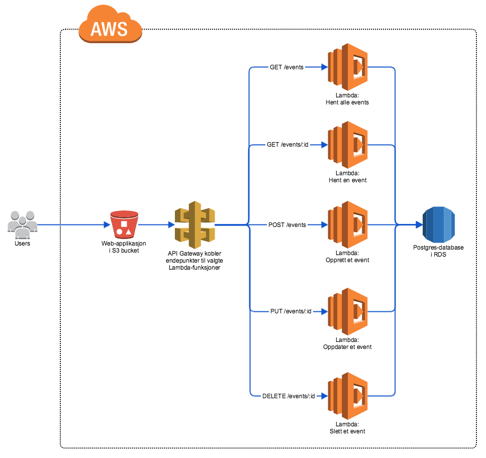

# Studentkurs 2019

I dette kurset skal vi sette opp en webapplikasjon med lagring til database med Amazon Web Services. Webapplikasjonen er en enkel sak for å opprette, endre, slette ogse på events. Den er skrevet i TypeScript med React.

## Oppsett av utviklingsmiljø lokalt

Sørg for at du har gjort det som behøves på forhånd. Se PDF som ble sendt ut før kurset. Hvis du ikke har fått den, ligger den [her]()

Så kan du klone repoer og sette opp kode:

1. Klone dette repoet
2. Klone [webapp](https://github.com/capraconsulting/studentkurs-2019-webapp) og følg instruksjonene der for å sette den opp

## Amazon Web Services (AWS)

Amazon Web Services er en rekke tjenester for ulike formål. Man har tjenester for å kjøre enkle virtuelle servere, tjenester for å sende e-post, prosessere enorme datamengder, lagring i ulike typer databaser, lagring av filer og lagring av statisk innhold til nettsider, for å nevne noe.

For å kunnee bruke AWS trenger man en konto. Man får mye gratis, slik at man kan komme i gang for en rimelig penge. Dersom du mangler konto, kan du se på instruksjonene vi sendte ut på forhånd for å få hjelp.

Man har flere forskjellige måter å jobbe med AWS på. Man kan bruke nettleseren, man kan lage maler som definerer hvordan ting skal fungere, eller man kan bruke kommandolinjen.

I dette kurset skal vi først sette opp tjenester med nettleseren, i den såkalte konsollen, og så oppdatere innholdet ved hjelp av AWS sitt CLI (Command Line Interface).

## Vi setter opp AWS-tjenester for applikasjonen vår

En vanlig webapplikasjon har tre lag: En frontend, en backend og en database. Frontenden er det vi ser, brukegrensesnittet. Backend har logikk og håndterer henvendelser fra frontend. Databasen lagrer data. Denne enkle figuren viser hvordan det kan se ut:

Når vi kjører dette, enten lokalt eller på en server, pleier man å kjøre tre ting: En webpplikasjon (frontend), en backendapplikasjon (for eksempel skrevet i Java) og en database (som Postgres eller MySQL). Da må man passe på at serveren, eller egen maskin, er oppdatert og tettet for alle sikkerhetshull.

Når vi jobber med AWS, kan vi i stedet bruke tjenester som er spesielt designet for det vi ønsker å gjøre, være seg å kjøre backendkode eller vise en webapplikasjon. Man kan kalle det å velge tjenester ut fra man ønsker å oppnå "Architecting for the Cloud". I dette kurset vil vi ha en arkitektur som ser slik ut:

| Tjeneste                    | Fortkortelse | Hva bruker vi den til?                                                                                                                                                                                                                                                                             |
| :-------------------------- | :----------- | :------------------------------------------------------------------------------------------------------------------------------------------------------------------------------------------------------------------------------------------------------------------------------------------------- |
| Simple Storage Service      | S3           | S3 brukes til lagring av data som skal akksesseres rimelig ofte. Det betyr gjerne nettsider og bilder lagres her. For eksemepl bruker Imgur S3 til å lagre nettsider. S3 brukes også i stor grad til å lagre, og vise, statiske nettsider og webapplikasjoner.                                     |
| API Gateway                 | -            | API Gateway lar deg definere endepunkt, og la disse peke på andre tjenester i AWS. Det betyr at du for eksempel kan lage et endepunkt for å lagre bilder i API Gateway, og peke det rett til S3. Da trenger du ikke programmere noe for å oppnå lagring via et API.                                |
| Relational Database Serivce | RDS          | RDS er en tjeneste for relasjonsdatabase. Her kan du lage databaseinstanser av typer som MySQL og Postgres. Med tradisjonelle servere må man gjerne passe på databaseinstansen, fordi de kjører på en server. Med RDS forholder du deg kun til databaseinstansen, ikke til serveren den kjører på. |
| Lambda Functions            | -            | Lambda Functions lar deg kjøre kode, helt uten en tradisjonell server. ...                                                                                                                                                                                                                         |

### Steg 1: Sette opp Simple Storage Service (S3)

Vi lager en bucket og laster opp webappen til den

### Steg 2 API Gateway

Vi oppretter API Gateway med endepunkter basert på en Swagger doc.

### Steg3: Relational Database Serivce (RDS)

Vi oppretter en database i RDS vi kan gi til Lambda Functions

### Steg 4: Lambda Functions

Oppretter lambda functions og legger inn kode via console/CLI

### Advanced section

-   Lek med webappen og legg til nye features
-   Legg til script i `package.json` for å deploye webappen
-   CloudFront for webappen
